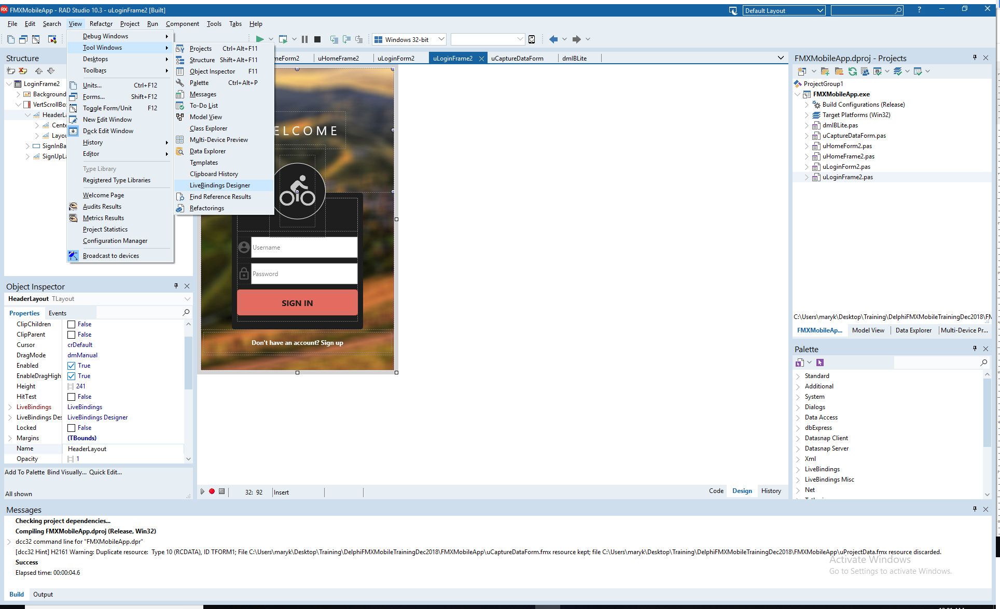
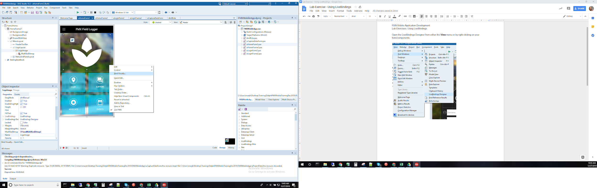
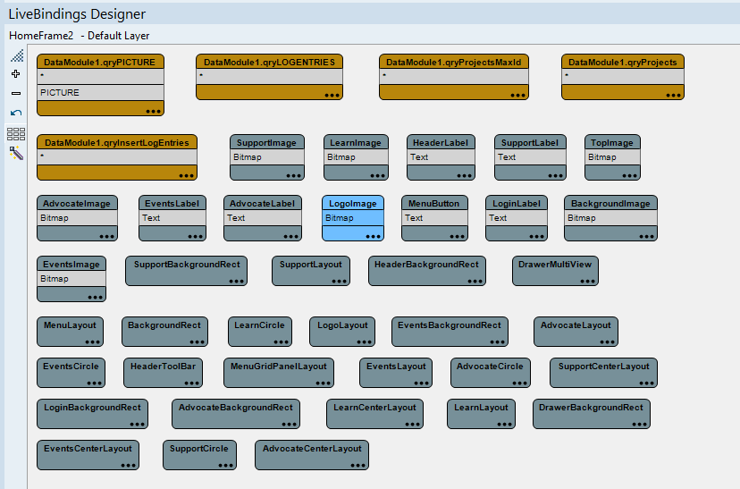
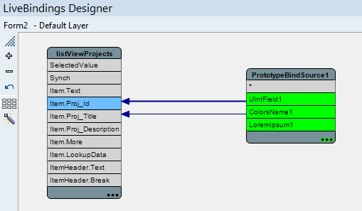

# Lab 03: Using LiveBindings

FMX Mobile Application Development

- Add a TPrototypeBindSource

  - Dbl Click -\> Add ContactBitmapsL & ContactNames

- Add TListView

  - Find the ItemAppearance.ItemAppearance property

    - Change it from ListItem to ImageListItem

  - Set ItemAppearanceObjects.ItemObjects.Visible to False

- Right Click ListView1 -\> Bind Visually...

  - Connect:

    - Sync -\> \*

    - Item.Text -\> ContactName1

    - Item.Bitmap -\> ContactBitmatL1

Open the LiveBindings Designer from either the **View** menu or by
right-clicking on your form/components.

{width="2.576609798775153in"
height="3.0807294400699914in"}

{width="3.4479166666666665in"
height="3.3333333333333335in"}

[In the LiveBindings Designer, your binding diagram contains just the
objects and you are ready to link them.]{.mark}

{width="5.507812773403325in"
height="3.636568241469816in"}

{width="5.302083333333333in"
height="3.09375in"}
