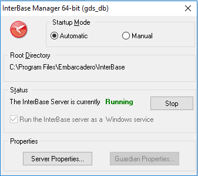
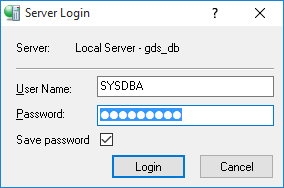

# FMX Mobile Application Development

**Lab Exercise 02.01: Starting up with InterBase**

Open the InterBase Server Manager (choose **Start \> Programs \>
Embarcadero InterBase 2017 \> InterBase Server Manager \[instance =
gds_db\]**).

{width="3.089601924759405in"
height="2.7413188976377953in"}

Use **Start** to start the server. The status text changes to
**Running**.

To see additional information about the InterBase Server, select
**Server Properties**.

{width="1.9883825459317586in"
height="3.2864588801399823in"}

To see additional information about the InterBase Guardian, select
**Guardian Properties**.

To log on to the local InterBase server:

1.  Open IBConsole.

2.  Use **Server \> Login**.

> {width="2.5781255468066493in"
> height="1.7074125109361329in"}

3.  Login using the default credentials (user:SYSDBA,
    password:masterkey).

4.  You can see the name of the logged-in user in the status bar of
    IBConsole
