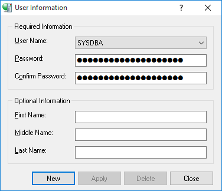

# FMX Mobile Application Development

**Lab Exercise 02.02: Creating users and setting up privileges for
each**

To create a new user, follow these steps:

1.  Login as user SYSDBA.

2.  Use **Server \> User Security \...**

> {width="2.9724978127734034in"
> height="2.557292213473316in"}

3.  Select **New**.

4.  Fill out the required fields:

    - User Name: **MGMT**.

    - Password: **manager**.

    - Confirm Password: **manager**.

5.  Select **Apply**.

6.  Repeat step 5 for a user called **staff** with the password:
    **staff**
