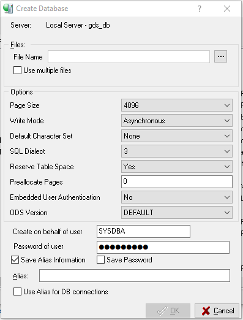
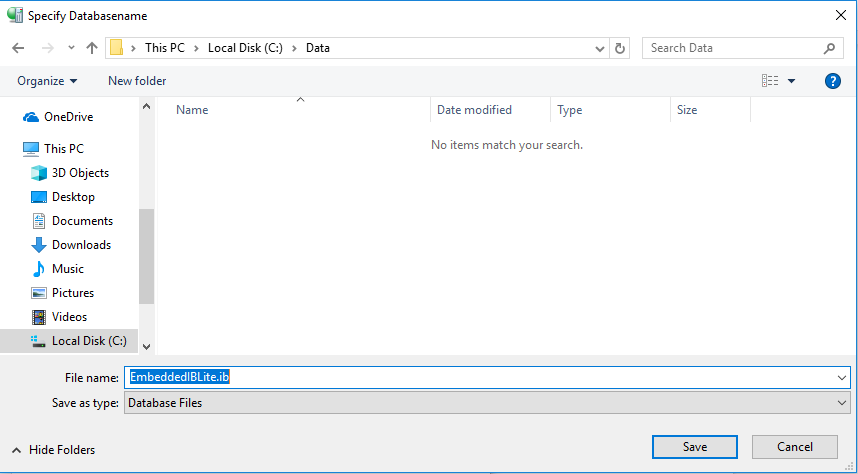
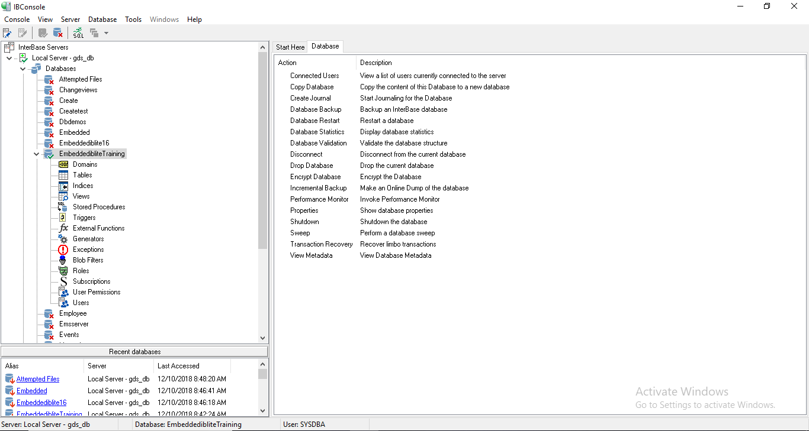

FMX Mobile Application Development

**Lab Exercise 02.03: Creating & Connecting to a database**

## [Creating the Database]{.mark}

In this training, you use the **EMBEDDEDIBLITE** database. Follow the
steps below to create that database:

1.  Log on to the server as the Username of your choice

2.  Select **Database \> Create Database**.

> {width="4.135416666666667in"
> height="5.4375in"}

3.  Enter **EmbeddedIBLite** in the **Alias** field.

4.  Use the **\...** button to browse to the location for the database
    or enter the location into the **File Name** field.

5.  **Note:** In this training, we use the C:\\Data\\embeddediblite.ib
    location. You can use another location if you wish.

6.  Use **EmbeddedIBLite.ib** as the file name.

{width="6.5in"
height="3.5972222222222223in"}

## [Connecting to the EmbeddedIBLite Database]{.mark}

To connect to the database, follow these steps:

1.  Select the EmbeddedIBLite database in the left pane of IBConsole.

2.  Choose **Database \> Connect**.

> **Note:** The **Database Connect** dialog opens automatically when you
> create the **IBLite** database.

3.  Enter the password for the user you are using.

4.  Use **Connect**.

> **Note:** Use the **Save Settings** check box to save the credentials
> for the next time that you connect to this database. In order to
> connect as a different user, choose **Database \> Connect As**.

5.  The status bar displays the name of the connected user, in this
    case: **SYSDBA**

> {width="5.369792213473316in"
> height="4.237299868766404in"}
