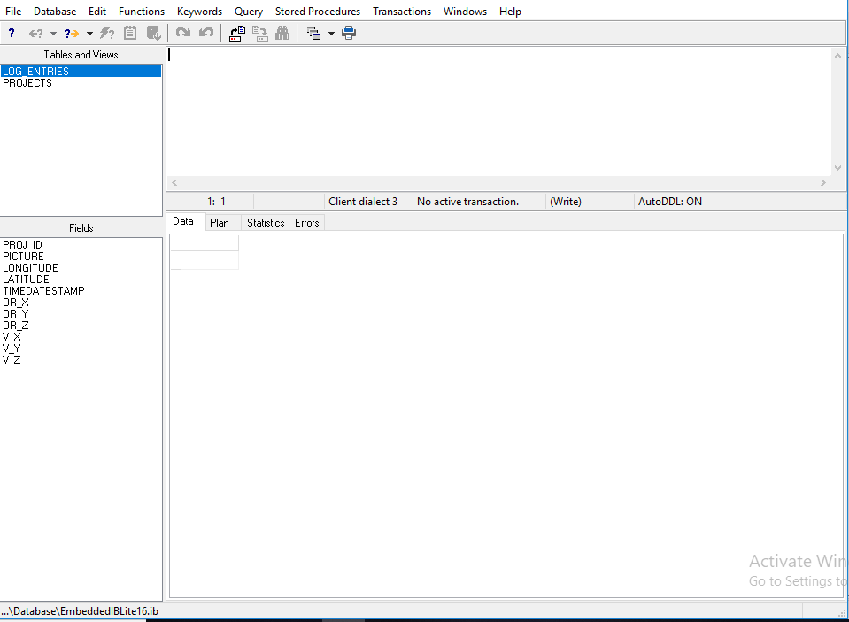

FMX Mobile Application Development

Lab Exercise 02.04: Creating Tables

A table is a data structure consisting of an unordered set of rows, each
containing a specific number of columns. Conceptually, a database table
is like an ordinary table. Much of the power of relational databases
comes from defining the relations among the tables. The **CREATE**
**TABLE** statement has the following general form:

**CREATE** **TABLE** tablename\
(\
colname1 **characteristics**\[,\
colname2 **characteristics**, ...\]\
\[, tableconstraint ...\]\
)

The column definitions are separated by commas. For each column, the
first word is the column name and the following words are
characteristics. The first column is a primary key.

1.  Open the Interactive SQL window

2.  You can see that the set of column definitions is surrounded by
    parentheses, and that the columns are separated by commas.

3.  Execute the statement.

4.  If you enter the code without errors, the table now exists in the
    database. To confirm, close the Interactive SQL window and select
    **Tables** in the left pane of the IBConsole. The image below shows
    the expected result.

You will see that the tables with custom fields are now available for
querying as in the following image:

{width="4.067724190726159in"
height="2.9739588801399823in"}
