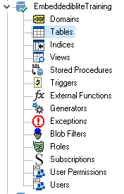
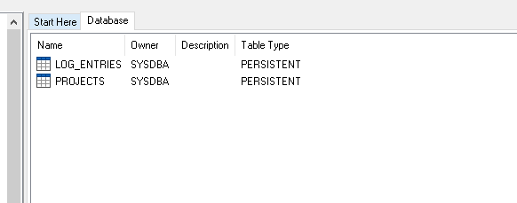

FMX Mobile Application Development

**Lab Exercise 02.05 : Running an InterBase Script**

You can execute sql scripts in the Interactive SQL window of the
IBConsole. To create, open or modify data definition files, you can use
a text editor such as Notepad++.

### **[CONNECT Statement]{.mark}**

Every SQL script must begin with a **CONNECT** statement. The
**CONNECT** statement specifies a complete path to the database, a user
name, and a password. However, if you connect to a database beforehand,
you may omit the **CONNECT** statement when executing an SQL script in
the Interactive SQL window.

If you do specify a connect statement, make sure to modify the values
accordingly. The SQL scripts that accompany this tutorial begin with the
following **CONNECT** statement:

**CONNECT** \'C:\\Data\\EMBEDDEDIBLITE.IB\'\
**USER** \'SYSDBA\' PASSWORD \'masterkey\'\
**NOTE:** Before executing a script with the above **CONNECT**
statement, check your paths and connection statement

[Run the EmbeddedIBLite.SQL Script]{.mark}

1.  Download the EmbeddedIBLite file to your computer.

2.  Load the **EmbeddedIBLite.SQL** script.

3.  Execute the query.

4.  To confirm that the tables now exist, click on **Tables** item in
    the left pane of IBConsole.

> {width="1.5052088801399826in"
> height="2.343824365704287in"}

You should see the following tables:

{width="5.265625546806649in"
height="2.0734044181977254in"}
