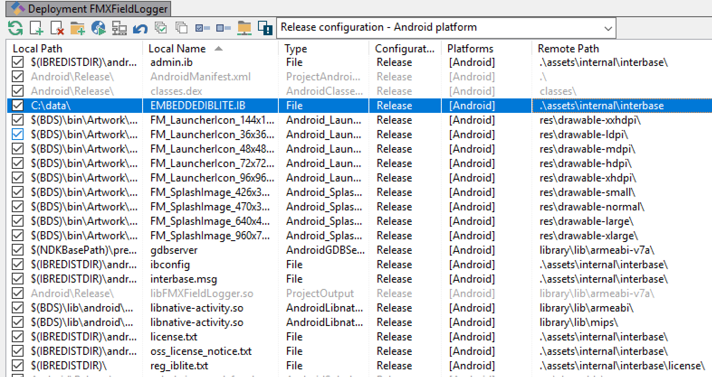
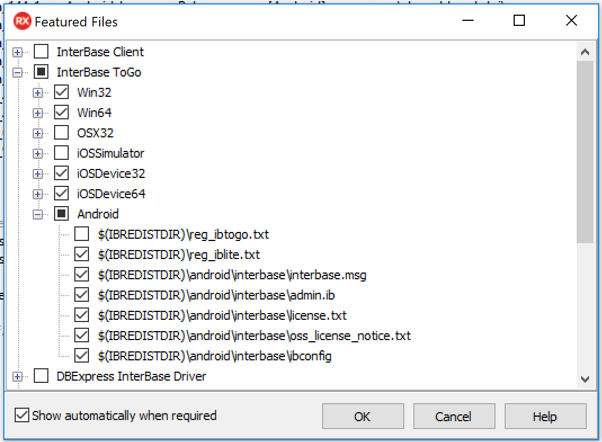

# **FMX Mobile Application Development**

## Lab Exercise 02.06: **Deploying InterBase IBLite Applications to Mobile Devices**

Up to this point, we have used the InterBase database on our desktop.
 This means that the actual database is located on your local hard
drive.  On the mobile devices, the application is sandboxed, and
typically you can only read and write data that is located in the
Documents folder for an IOS device and internal storage for an Android
device, under your application folder.  So to connect to a local
database on mobile, we need to perform a few actions. Those actions are:

1\. For our mobile devices, we need to deploy both our **InterBase
IBlite** or ToGo database and our InterBase ToGo license file
(reg_iblite.txt or reg_intogo.txt).  

2\. To make this easy for us, we can use **Project \| Deployment.**

3\. Select All Configurations - Android platform, and using the Add file
button we can add both our InterBase IBlite or ToGo database file and
InterBase IBlite or ToGo license file.  

Here we see we added our InterBase IBlite database file (using the Add
File button), and for the remote path on our mobile device, we set it to
the Android's Documents folder which is the internal storage location
for Android, which is .assets/internal.  And we do the same for our
InterBase IBlite license file and give it the Remote Path of
.assets/internal/interbase/license:

{width="6.5in"
height="3.4504133858267716in"}

4\. And similar for iOS devices, select iOS Devices (32 and 64 bit) ALL
Configurations.  The InterBase IBlite database file goes in the iOS
Device Documents folder using the Remote Path property, which is
 StartUp/Documents.

5\. And the same for the InterBase IBlite license file in the
StartUp/Documents folder on the iOS Device.

Deployment Managers \| Add Featured File

1\. Use the **Deployment Managers** \| **Add Featured Files** dialog box
that shows a nested list of database drivers and libraries that can be
added to the deployment list:

{width="6.5in"
height="4.773152887139108in"}

2\. Select and add your needed IBlite files for Android and iOS.

3\. Deploy your FMX Field Logger application to Android and/or iOS and
verify the app works the same as you have been testing on Windows.
