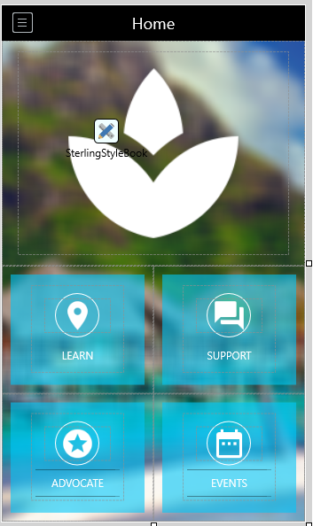
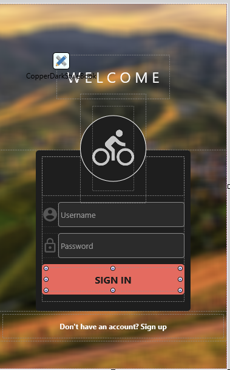

# FMX Mobile Application Development

## **LAB EXERCISE 03.01:** Home and Login Screens

To help get us started with our FMX cross-platform UIs, we will use two
of the included FMX GUI Templates; The Home Screen and the Login Screen.

The FMX GUI Templates are a set of UI template projects for FireMonkey
in Embarcadero RAD Studio available via Embarcadero GetIt.

You can access these Templates using **Tools \| Getit Package Manager**,
select **Sample Projects Category**.

For the sample Mobile application, we will install the Delphi Home
Screen and the Login Screen applications.

Steps:

1\. On the 10.3 Rio IDE Welcome Page, click **Get Add-Ons from Getit**

2\. Select Sample Projects Category \| Select **App Home Screens** \|
**Install \| Close**

This installs a sample Welcome / Home Screen application in your default
folder:
C:\\Users\\Public\\Documents\\Embarcadero\\Studio\\20.0\\Samples\\**Object
Pascal\\App Home Screens**\\

3\. You have 3 projects with Home Screens.

4\. Open **HomeProject2. HomeProject2** looks like this:

{width="1.9668613298337707in"
height="3.321092519685039in"}

5\. Let\'s use this **HomeProject2** as our Main Form, Home Screen for
our FMXMobileApplication.

6\. File \| **Save Project As** \| New Folder \|
C:\\Users\\amannarino\\Documents\\Embarcadero\\Studio\\Projects\\
**FMXMobileApp Project Name = FMXMobileApp**

Next, let\'s use one of the 10.3 Rio templates for our Login Screen.

**Login Screens**

1\. Using GetIt Project Manager, Sample Projects, Select and Install the
**Login Screens.**

2\. The Login Screen app gets installed in this default location,
C:\\Users\\Public\\Documents\\Embarcadero\\Studio\\20.0\\Samples\\Object
Pascal\\**Login Screens**\\

You have 3 projects with different Login Screens. **LoginProject2** look
like this:

{width="2.78125in"
height="4.479166666666667in"}

3\. File \| Save All, File \| Close All.

We will use these two units; **uHomeFrame2.pas** and
**uLoginFrame2.pas** as the starting screens for our FMX Mobile
Application.
