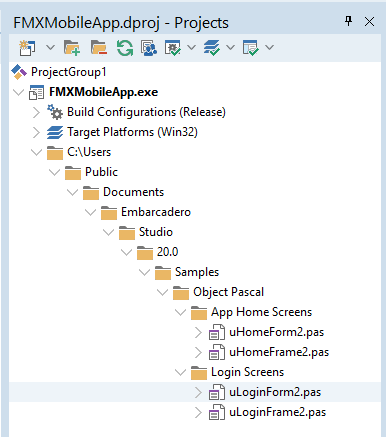
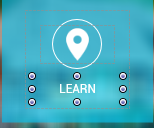
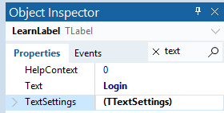
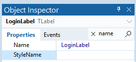
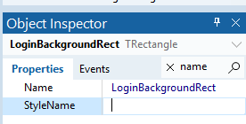
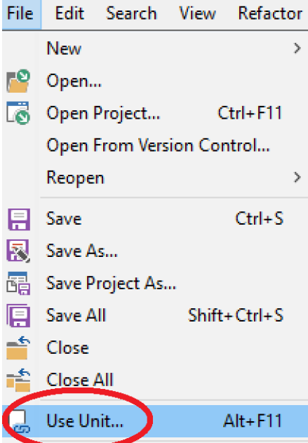
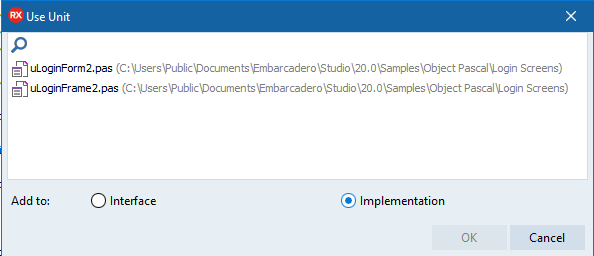
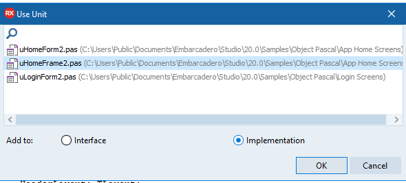

# FMX Mobile Application Development

## **Lab Exercise 03.02:** Working with Multiple Screens 

The main form, the Home Screen form, **uHomeFrame2**, of the application
is displayed at application startup, and its lifetime is the same as the
application.

Now we will implement the functionality to navigate between the Home
Screen Form and the Login Form. In the main form, the Home Screen Form,
when we click on the Login button, we want to call the Show method of
the Login form, **uLoginForm2**.

## Steps:

1\. Open your FMXMobileApp project.

2\. In the Project Manager, Right-Click on FMXMobileApp.exe \| Add \|
C:\\Users\\Public\\Documents\\Embarcadero\\Studio\\20.0\\Samples\\Object
Pascal\\Login Screens\\**uLoginFrame2**

Also Add \| \|
C:\\Users\\Public\\Documents\\Embarcadero\\Studio\\20.0\\Samples\\Object
Pascal\\Login Screens\\**uLoginForm2**

Your FMXMobileApp project should now look like this, with both your
**App Home Screens** and your **Login Screen**
files:{width="3.357306430446194in"
height="3.8008891076115487in"}

3\. On the **uHomeFrame2** Screen, let\'s change the LearnLabel text =
**Login**.

Change LearnLabel name = **LoginLabel.**

Change LearnBackgroundRect name = **LoginBackgroundRect**

{width="1.6041666666666667in"
height="1.3333333333333333in"}

{width="2.9166666666666665in"
height="1.4791666666666667in"}

{width="2.9166666666666665in"
height="1.3333333333333333in"}

{width="2.875in"
height="1.4583333333333333in"}

## Navigation between the forms

The main form, the Home Screen form, **uHomeFrame2**, of the application
is displayed at application startup, and its lifetime is the same as the
application.

Now we will implement the functionality to navigate between the Home
form and the Login Form. In the main form, the Home Screen Form, when we
click on the **Login** button, we want to call the **Show** method of
the Login form, **uLoginForm2**.

However, **our Home Screen form** does not know about **the Login
Form**. We need to add **the Login Form** to the uses clause of the
**Home Screen Form**.

We could do it manually, but the RAD Studio IDE help us to do this.

{width="2.2868055555555555in"
height="3.2868055555555555in"}

1\. Make sure that the **uHomeForm2** file is open in the Code Editor
and click on the **Use Unit\...** option in the **File** menu, as shown
in the following screenshot:

2\. In the **Use Unit\...** dialog, select **uLoginFrame2** and keep the
default selection of **Implementation** to add this unit to the **uses**
clause of the implementation section of the **uHomeFrame2** unit. This
dialog will list all the other units in the current project that are not
yet used by the currently selected unit, as shown in this screenshot:

{width="6.0in"
height="2.5833333333333335in"}

3\. The next step is to do the same thing in the **LoginFrame2**. Add
**HomeFrame2** to the **implementation** section of the **uses** clause
of **LoginFrame2**.

{width="6.0in"
height="2.71875in"}

4\. **Double-click** on the **Login button** on the **HomeFrame2
screen** and enter these two lines of code in the button OnClick Event
Handler, **LoginBackgroundRectClick**, to first hide the Home Screen and
then show the Login Form of our application:

  -----------------------------------------------------------------------
  [**procedure** THomeFrame2.LoginBackgroundRectClick(Sender: TObject);\
  **begin**\
  uHomeForm2.Form2Home.Hide; //Hide the Home Screen.\
  uLoginForm2.Form2Login.Show; //Show the Login Screen\
  **end**;]{.mark}
  -----------------------------------------------------------------------

  -----------------------------------------------------------------------

5\. File \| Save All.

6\. Run the FMXMobileApp as a **Win32 application** and test the Login
navigation to your LoginForm.
