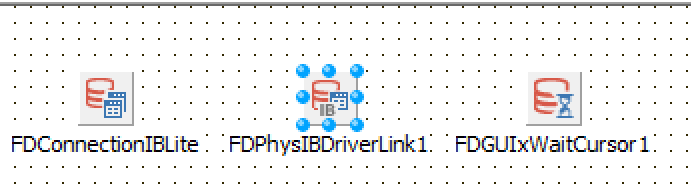
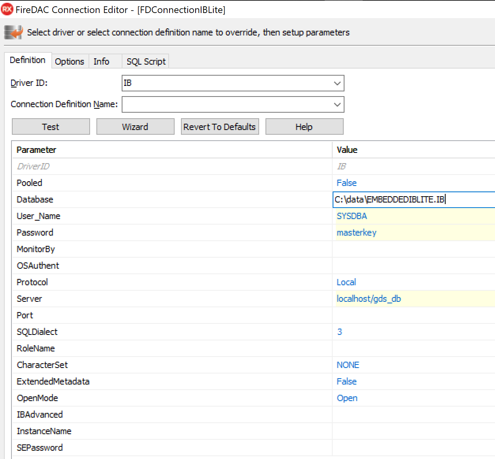
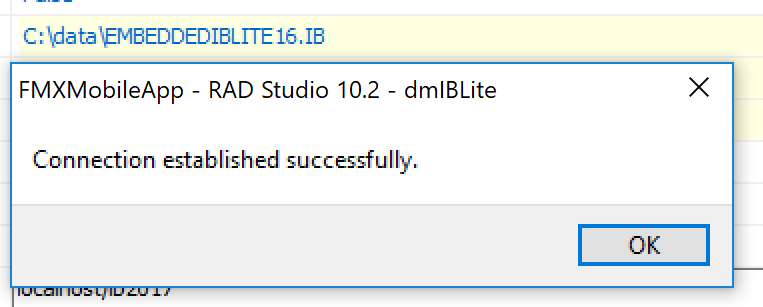
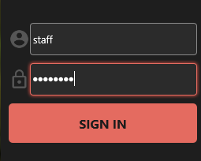

# FMX Mobile Application Development

## **Lab Exercise 03.04:** Authenticate user against InterBase

Next, now that we have our Login form displayed, we need to enter the
Username and Password of our IBlite database to login (authenticate) our
Application.

The Iblite database we will be using for our application, has a username
'**staff**' with password 'password' that has Read, Write and Update
permissions, and a User '**manager**' with password 'password' that has
Read, Write, Update and Delete permissions.

Steps:

1\. Add \| New \| Other \| **DataModule**

2\. Save DataModule as **dmIBlite.**

3\. On the DataModule, add **FDConnection, FDPhysIBDriverLInk and a
FDGUIxWaitCursor**, like this:

{width="5.366694006999125in"
height="1.4523326771653544in"}

4\. **Double-click** the **FDConnectionIBLite** component and set its
database properties to your IBLite Database, **EMBEDDEDIBLITE.IB**, like
this:

Driver ID = **IB**

Database = \<location of your **EMBEDDEDIBLITE.IB** database\>

Username = **SYSDBA**

Password = **password**

Protocol = **Local**

Server = **localhost/gds_db**

**Note: Locally on Windows, we will be testing and working with the
IBLite database using your installed InterBase 2017 Developer Edition.**

{width="3.8646227034120737in"
height="3.5933552055993in"}

5\. Click the Test button, and verify you can connect locally to your
EMBEDDEDIBLITE.IB database:

{width="4.671966316710411in"
height="1.8797692475940508in"}

Click OK.

6\. For deployment to mobile devices, assure that you have your
**IBLite.txt** license file in your **IBREDISTDIR** folder:
C:\\Users\\Public\\Documents\\Embarcadero\\InterBase\\redist\\InterBase2017

7\. In the project, create a new Multi-Device Unit called **uCamera.**
We will navigate to this **uCamera Form,** if we successfully
authenticate the user against our InterBase database.

8\. On the **Login Screen**, enter **staff** for the Username and
**password** for the password.

{width="2.65625in"
height="2.125in"}

9\. To authenticate against the Username and Password for the InterBase
database, use this code for the **OnClick event** of the **SIGN IN**
button:

  ------------------------------------------------------------------------
  **procedure** TForm2Login.LoginFrame21SignInRectBTNClick(Sender:
  TObject);\
  **begin**\
  LoginFrame21.SignInText.**Text** := \'Autenticating\...\';\
  dmIBLite.DataModule1.FDConnectionIBLite.Params.Values\[\'USER_NAME\'\]
  :=\
  LoginFrame21.UsernameEdit.**Text**;\
  dmIBLite.DataModule1.FDConnectionIBLite.Params.Values\[\'Password\'\]
  :=\
  LoginFrame21.PasswordEdit.**Text**;\
  **try**\
  **Begin**\
  dmIBLite.DataModule1.FDConnectionIBLite.Connected := **True**;\
  labelLoggedInUser.**Text** := LoginFrame21.UsernameEdit.**Text** + \'
  logged in\';\
  LoginFrame21.SignInText.**Text** := \'Connected!\';\
  //Hide the Login Screen.\
  uLoginForm2.Form2Login.Hide;\
  //Show the next Form, the MultiTabbed Camera Form.\
  uCamera.Form1.Show;\
  **End**;\
  **Except**\
  **on** E: **Exception** **do**\
  **begin**\
  labelLoggedInUser.**Text** := LoginFrame21.UsernameEdit.**Text** +\
  \' failed to log in\';\
  LoginFrame21.SignInText.**Text** := \'SIGN IN\';\
  ShowMessage(\'Invalid UserName/Password or Connection to IBLite
  database\');\
  **end**;\
  **end**;\
  **end**;
  ------------------------------------------------------------------------

  ------------------------------------------------------------------------

## Handling FireDAC Connection Errors

**See:
[http://docwiki.embarcadero.com/RADStudio/en/Establishing_Connection\_(FireDAC)](http://docwiki.embarcadero.com/RADStudio/Rio/en/Establishing_Connection_(FireDAC))**

If the FireDAC connection fails, then your application may analyze the
failure using one of the approaches:

\- using TFDCustomConnection.OnError event handler. This is more
appropriate when a connection is opened implicitly.

\- using the try \... except \... end syntax. This is the best approach
with an explicit connection establishment. For example:

  -----------------------------------------------------------------------
  **uses**\
  FireDAC.Stan.Consts, FireDAC.Stan.Error;\
  //\...\
  **try**\
  FDConnection1.Connected := **True**;\
  **except**\
  **on** E: EFDException **do**\
  **if** E.FDCode = er_FD_ClntDbLoginAborted **then**\
  ; // user pressed Cancel button in Login dialog\
  **on** E: EFDDBEngineException **do**\
  **case** E.Kind **of**\
  ekUserPwdInvalid: ; // user name or password are incorrect\
  ekUserPwdExpired: ; // user password is expired\
  ekServerGone: ; // DBMS is not accessible due to some reason\
  **else** // other issues\
  **end**;\
  **end**;
  -----------------------------------------------------------------------

  -----------------------------------------------------------------------
