# FMX Mobile Application Development

## Lab Exercise 03.05: Working with Default FMX Styles.

See:
[[http://docwiki.embarcadero.com/RADStudio/en/Customizing_FireMonkey_Applications_with_Styles]{.underline}](http://docwiki.embarcadero.com/RADStudio/en/Customizing_FireMonkey_Applications_with_Styles)

FireMonkey controls are arrangements of a tree composed of subcontrols,
primitive shapes, and brushes, decorated with effects. These
compositions are defined as styles, stored in a style book. The
individual elements of a style are internally called resources; because
that term has several other meanings, the term style-resource is used
for clarity. Styles provide a great deal of customizations without
subclassing.

The FireMonkey styles that are provided with the product are saved in.
Style files located in C:\\Program Files
(x86)\\Embarcadero\\Studio\\20.0\\Redist\\styles\\Fmx.

1\. Create a new multi-device blank application.

2\. In a new folder, **FMXDefaultStyles**, save the main form unit as
**uDefaultStyles** and the whole project as **FMXDefaultStyles.**

3\. While in the IDE Designer, above the form designer area there is a
**Style combo-box** where you can change the style that is used to
preview the form you are working with, that looks like this:

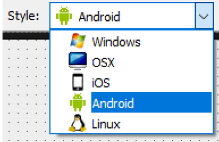{width="3.6553094925634295in"
height="2.3721522309711287in"}

4\. The selection of a style in the Style combo applies different styles
to the form we are working with, so we can see how a given form will
look when it is compiled for the selected platform. For Platform style,
there are 4 markers for each target platform, such as Windows, OS X,
Android, and iOS.

5\. Drop a
[**[TToolbar]{.underline}**](http://docwiki.embarcadero.com/Libraries/en/FMX.StdCtrls.TToolBar)
component on the form. The Toolbar should automatically get Aligned to
the Top of your form. Next, add a
**[[TSpeedButton]{.underline}](http://docwiki.embarcadero.com/Libraries/en/FMX.StdCtrls.TSpeedButton)**
on the toolbar. Align the speed button to the Left. If needed, enlarge
the TSpeedButton so you can see all of the text SpeedButton1 on the
control, like this:

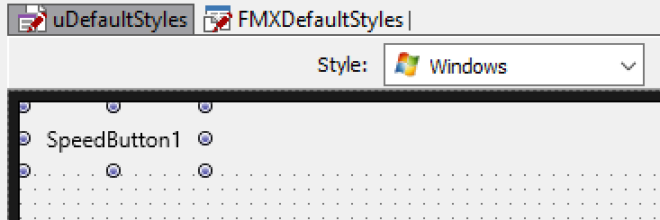{width="3.623205380577428in"
height="1.2135422134733158in"}

6\. Next, using the Style combo, change the style from Windows to
**iOS.**

When you do this, notice the **look-and-feel** of the TSpeedButton
changes for the selected platform design rules, like this:

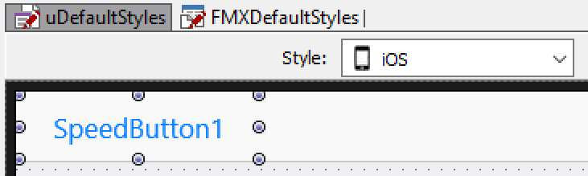{width="3.776042213473316in"
height="1.1316021434820647in"}

7\. Now, using the Style combo, change the style from iOS to
**Android.** When you do this, notice the look-and-feel of the
TSpeedButton changes for the Android platform design rules, like this:

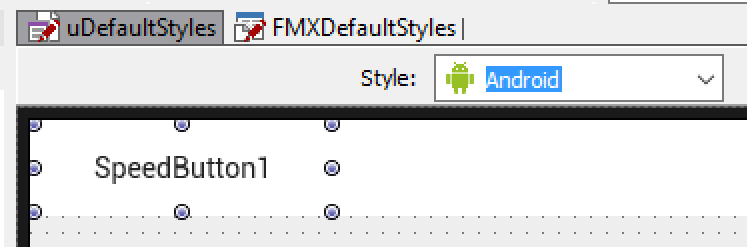{width="3.838234908136483in"
height="1.265625546806649in"}

Within a style, there could be more than one definition of how a given
control could look. FireMonkey controls have a **StyleLookup property**
that we can use to apply a different style definition.

8\. In the Object Inspector, click on the drop-down button next to the
**StyleLookup** property to see different styles that can be applied to
a TSpeedButton control, like this:

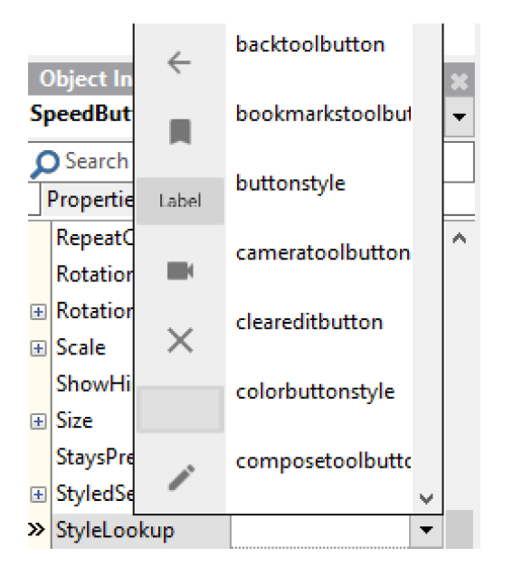{width="3.3724321959755033in"
height="3.7864588801399823in"}

Depending on the selected platform the choices can be different.

9\. Select the **cameratoolbutton,** from the list of available choices
for the StyleLookup property. Notice that the TSpeedButton changes to a
Camera button for the Target platform you have selected in the Style
combo. For Android, the Camera button looks like this:

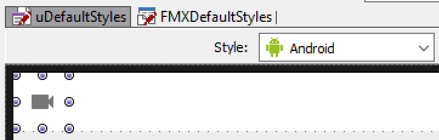{width="3.315326990376203in"
height="1.0572922134733158in"}

10\. On the Style Combo, change the platform from Android to iOS. Now
the Camera button on iOS looks like a corrected styled Camera button on
iOS that looks like this:

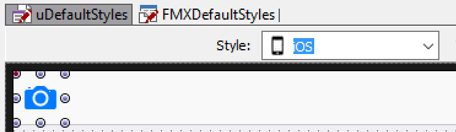{width="3.321823053368329in"
height="0.9635422134733158in"}

11\. Feel free to add additional controls on your FMX Multi-Device form,
and see for yourself how the controls will look on iOS and Android. And
everything here also applies to desktop platforms; Windows and Mac OS X.

12\. As we have seen in this lab exercise, with FireMonkey, each control
class has a default style, hard-coded per platform. To see the internal
hard-coded style for a control class, right-click on the FMX control and
select the **Edit Default Style** command on the control\'s shortcut
menu.

13\. As an example, add a
**[[TPanel]{.underline}](http://docwiki.embarcadero.com/Libraries/en/FMX.StdCtrls.TPanel)**
on to your form:

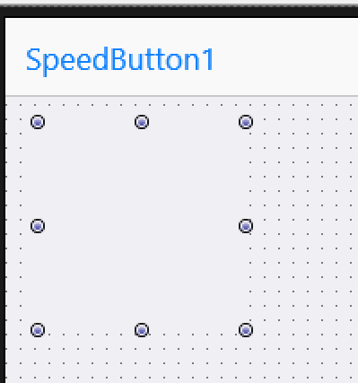{width="1.7655096237970254in"
height="1.890625546806649in"}

14\. Right-click on the TPanel and select the **Edit Default Style**
command on the control\'s shortcut menu.

15\. In the Structure pane, select the TPanel component that you can
change:

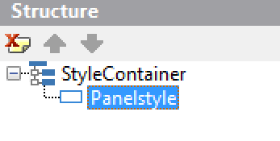{width="2.716101268591426in"
height="1.3697922134733158in"}

16\. We see, from the Object Inspector, the default style of
FMX.StdCtrls.TPanel is defined simply as: **panelstyle: TRectangle**

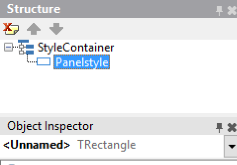{width="2.5468755468066493in"
height="1.7674693788276465in"}

17\. The name of the style-resource that defines the style is
\"**panelstyle**\". It refers to a TRectangle. The appearance of this
rectangle can be changed in the **Style Designer**, and then every
TPanel on the form will have that appearance by default.

18\. However, there is no rule that a TPanel must be represented by a
TRectangle. A TRoundRect or TEllipse would work. Even simple controls
can be a complex composition.

19\. Next, add a
**[[TCheckBox]{.underline}](http://docwiki.embarcadero.com/Libraries/en/FMX.StdCtrls.TCheckBox)**
on your
form: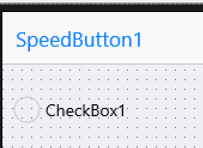{width="1.88043416447944in"
height="1.3701093613298339in"}

20\. Right-click on the TCheckbox and select the **Edit Default Style**
command on the control\'s shortcut menu.

21\. On the Structure Pane, we see that a FMX TCheckBox control looks
something like this:

- **checkboxstyle:** TLayout (the entire control)

  - TLayout (the layout for the box)

    - background: TRectangle (the box itself, which is a composition
      of:)

      - TGlowEffect (glows when the control has focused)

      - TRectangle (the outside rectangle that forms the box)

      - TRectangle (the inside rectangle)

      - TColorAnimation (color animation when the mouse moves over)

      - TColorAnimation (and back out)

      - checkmark: TPath (the check inside the box, drawn as a path,
        which has:)

        - TColorAnimation (its color animation when the check is toggled
          on or off)

  - text: TText (and back under the top level, the text label)

The style is named so that it can be found and used. In addition,
certain sub-elements are named, so that they can be referenced. When the
IsChecked property of the CheckBox is toggled, the \"checkmark\" has its
visibility changed (by animating the opacity of its color from solid to
transparent). Setting the Text property of the TCheckBox sets the Text
property of the underlying TText named
\"text\".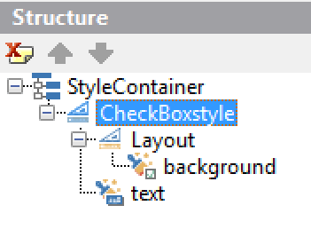{width="2.6310334645669293in"
height="2.0013845144356956in"}

This was an overview on how to use the **Style combo,** to show how the
same app running on iOS will look like a regular iOS app, and when
compiled for Android, it will look like an Android app. You can also
compile the project for desktop targets and then an appropriate Windows
or Mac style will be used.

This lab also gave an overview on how you can use the **Edit Default
Style** command on the control\'s shortcut menu, to make changes to the
default style of the control.
