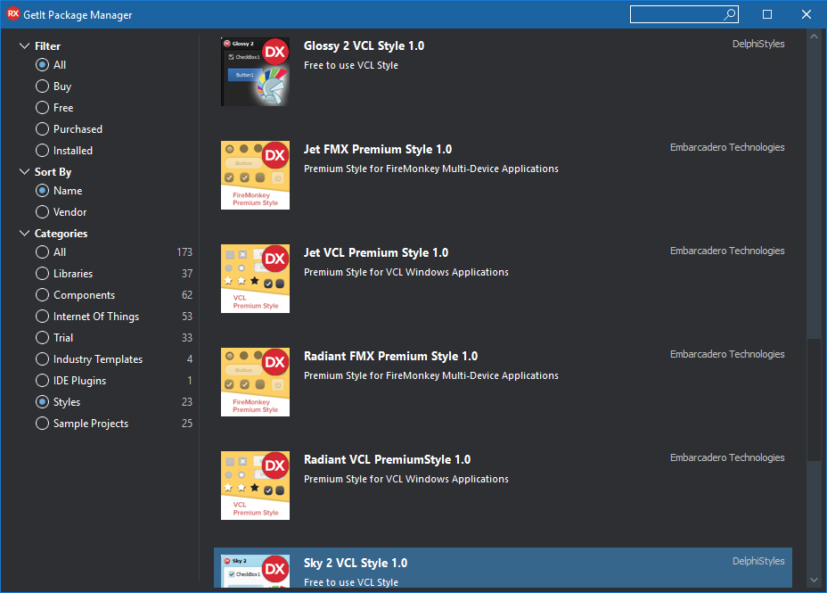
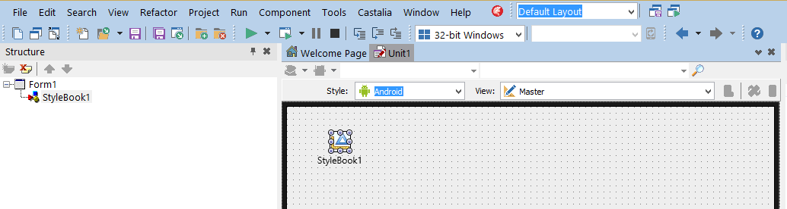

# FMX Mobile Application Development

## Lab Exercise 03.06: StyleBook and Working with Custom Styles.

FireMonkey applications automatically load and display the appropriate
native style at run time (depending on the target device), without you
needing to add a stylebook or any code. Also, FireMonkey applications
can have **custom styles** that display well on high-resolution displays
as well as standard-resolution displays. High-resolution styles (such as
Retina) are only shown at run time.

## Loading Your Own Custom Styles

The Lab Exercise describes working with custom styles, such as the
**Jet** style, which is available in the FireMonkey Premium Style Pack,
that you can download from GetIt

[[http://docwiki.embarcadero.com/RADStudio/en/Installing_a_Package_Using_GetIt_Package_Manager]{.underline}](http://docwiki.embarcadero.com/RADStudio/en/Installing_a_Package_Using_GetIt_Package_Manager)

{width="6.5in"
height="4.652777777777778in"}

Adding a Custom Style to Your Mobile Application

RAD Studio includes the following custom mobile styles:

- **Android**:

  - AndroidDark.fsf

  - AndroidLDark.fsf

  - AndroidLDarkBlue.fsf

  - AndroidLight.fsf

  - AndroidLLight.fsf

  - GoogleGlass.fsf

- **iOS**:

  - iOSBlack.fsf

  - iOSTransparent.fsf

These styles are installed on your system, in the **Styles** directory,
in the following platform-specific directories:

C:\\Users\\Public\\Documents\\Embarcadero\\Studio\\20.0\\**Styles\\iOS**

C:\\Users\\Public\\Documents\\Embarcadero\\Studio\\20.0\\**Styles\\Android**

The custom mobile styles for iOS and Android include support for
standard- and high-resolution devices within one style file. This
includes built-in support for:

- iOS standard, iOS Retina devices (1x, 2x) and iOS Retina HD devices
  (3x)

- Multiple resolutions for Android devices (1x, 1.5x, 2x, 3x)

In addition, you can get new FireMonkey styles that are available in
the [[FireMonkey Premium Style
Pack]{.underline}](http://cc.embarcadero.com/item/30491), which also
support 3x resolution for iOS 8 devices.

To add a custom style to a FireMonkey multi-device application

1.  Create a [**[Multi-Device
    Application]{.underline}**](http://docwiki.embarcadero.com/RADStudio/en/Multi-Device_Application).

2.  With the **Master** view selected, add
    a [**[TStyleBook]{.underline}**](http://docwiki.embarcadero.com/Libraries/en/FMX.Controls.TStyleBook) component
    to your form.

3.  On the **Master** view, select a style from the Form
    Designer **Style** drop-down menu (Windows, OSX, iOS, or Android).
    This example uses Android style for the **Master** view:

{width="6.5in"
height="1.735009842519685in"}

4\. Load a FireMonkey style file for the appropriate platform:

1.  Double-click the StyleBook. The [**[FireMonkey Style
    Designer]{.underline}**](http://docwiki.embarcadero.com/RADStudio/en/FireMonkey_Style_Designer) opens.

2.  Click the {width="0.16666666666666666in"
    height="0.16666666666666666in"} button on the toolbar of
    the **FireMonkey Style Designer**.

3.  Navigate to the FireMonkey style file you want.

For example, if **Android** is the Form Designer style set for the
current view, you would load and assign an Android style such
as **AndroidLight.fsf**.

**Note:** The FireMonkey styles for the various Form Designer styles are
located in parallel directories:

**Windows:** C:\\Users\\Public\\Documents\\Embarcadero\\Studio\\20.0\\Styles

**Android:** C:\\Users\\Public\\Documents\\Embarcadero\\Studio\\20.0\\Styles\\Android

**iOS:** C:\\Users\\Public\\Documents\\Embarcadero\\Studio\\20.0\\Styles\\iOS

5\. Switch to each of your created views, select
the **TStyleBook** component in that view, and load the custom style
related to that platform. When working with custom FireMonkey styles,
each view, including the **Master**view, must have a style assigned in
the Form Designer.

That is, load a Windows style for the \"Windows Desktop\" view, an
Android style for the \"Android\...\" view, a Mac style for the \"OS X
Desktop\" view, an iOS style for the \"iPad\" and the \"iPhone\" views.

**Note:** If you have different views for iPad and iPhone, you need to
load the same iOS style for each view.

6\. To use the custom style instead of the native style on a form, you
need to assign the stylebook you want to use to the form at design time:

- On
  the [[StyleBook]{.underline}](http://docwiki.embarcadero.com/Libraries/en/FMX.Forms.TForm.StyleBook) property
  of the form, select the StyleBook to apply from the drop-down menu.

- **Note:** See [[Using Custom Styles on Multiple
  Forms]{.underline}](http://docwiki.embarcadero.com/RADStudio/en/Working_with_Native_and_Custom_FireMonkey_Styles#Using_Custom_Styles_on_Multiple_Forms) to
  learn how to apply a specific custom style to multiple forms without
  editing
  the [[StyleBook]{.underline}](http://docwiki.embarcadero.com/Libraries/en/FMX.Forms.TForm.StyleBook) property
  of each form.

## Using Custom Styles on Multiple Forms

To apply the same custom style to all the forms of an application,
instead of doing it at design time setting the
[[StyleBook]{.underline}](http://docwiki.embarcadero.com/Libraries/en/FMX.Forms.TCommonCustomForm.StyleBook) property
of each form, you can do it at run time using
the [[UseStyleManager]{.underline}](http://docwiki.embarcadero.com/Libraries/en/FMX.Controls.TStyleBook.UseStyleManager) property.

To use the same custom style on all the forms of an application.

- Place
  the [[TStyleBook]{.underline}](http://docwiki.embarcadero.com/Libraries/Rio/en/FMX.Controls.TStyleBook) component
  on the main form.

- Set
  the [[UseStyleManager]{.underline}](http://docwiki.embarcadero.com/Libraries/Rio/en/FMX.Controls.TStyleBook.UseStyleManager) property
  on the [[Object
  Inspector]{.underline}](http://docwiki.embarcadero.com/RADStudio/en/Object_Inspector) to True

- Double-click the StyleBook to open the **FireMonkey Style
  Designer** and [[load the
  style]{.underline}](http://docwiki.embarcadero.com/RADStudio/en/Working_with_Native_and_Custom_FireMonkey_Styles#To_add_a_custom_style_to_a_FireMonkey_multi-device_application).

## 

## Using Custom Styles on Controls in Multiple Forms

An application may have more than
one [[TStyleBook]{.underline}](http://docwiki.embarcadero.com/Libraries/Rio/en/FMX.Controls.TStyleBook) object,
then different forms may use
the [[StyleBook]{.underline}](http://docwiki.embarcadero.com/Libraries/Rio/en/FMX.Forms.TForm.StyleBook) property
to reference any of these stylebooks, one at a time. Notice that
controls in any form can always use
the [[StyleLookup]{.underline}](http://docwiki.embarcadero.com/Libraries/Rio/en/FMX.Controls.TStyledControl.StyleLookup)
property to specify any custom style defined in
any [[TStyleBook]{.underline}](http://docwiki.embarcadero.com/Libraries/Rio/en/FMX.Controls.TStyleBook) object
used in the current project group.
