# FMX Mobile Application Development

## Lab Exercise: 03.07 Tab Components to Display Pages on both iOS and Android.

Tabs are defined
by [**[FMX.TabControl.TTabControl]{.underline}**](http://docwiki.embarcadero.com/Libraries/en/FMX.TabControl.TTabControl),
which is a container that can hold several tab pages. Each tab page can
contain any control as a UI element. You can hide the tab for these
pages, and change pages without showing tabs.

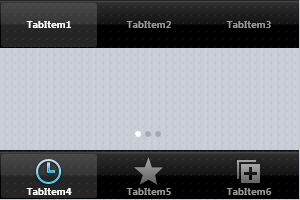{width="3.125in"
height="2.0833333333333335in"}

For each tab, you can specify:

- A text label --- for both iOS and Android

- Predefined icons --- for iOS only

- Custom icons --- for both iOS and Android

## Using the Native Style for Tabs on iOS and Android

This Lab Exercise shows tabs with the same style on both iOS and
Android, but this practice is not recommended. \
We recommend that you observe the native style of each platform, as
follows:

**On Android:**

- Tabs are commonly placed at the top of the screen (so you should
  set [[TTabPosition]{.underline}](http://docwiki.embarcadero.com/Libraries/en/FMX.TabControl.TTabPosition) either
  to **Top** or to **PlatformDefault**).

- Tabs traditionally display only text. However, FireMonkey allows you
  to specify custom icons to be displayed on tabs (see [[Using Custom
  Multi-Resolution Icons for Your
  Tabs]{.underline}](http://docwiki.embarcadero.com/RADStudio/en/Mobile_Tutorial:_Using_Tab_Components_to_Display_Pages_(iOS_and_Android)#Using_Custom_Multi-Resolution_Icons_for_Your_Tabs)).

**[On iOS:]{.mark}**

- Tabs are typically shown at the bottom of the screen (so you should
  set [[TTabPosition]{.underline}](http://docwiki.embarcadero.com/Libraries/en/FMX.TabControl.TTabPosition) either
  to **Bottom** or to **PlatformDefault**).

- Tab items always display both text and an icon, which can be set via
  the [[StyleLookup]{.underline}](http://docwiki.embarcadero.com/Libraries/en/FMX.TabControl.TTabItem.StyleLookup) property
  for each tab.

[**Note:** You can use the **PlatformDefault** value of
the [[TTabPosition]{.underline}](http://docwiki.embarcadero.com/Libraries/en/FMX.TabControl.TTabPosition) enumeration
to set the tab position according to the default behavior of the target
platform. When **PlatformDefault** is set
for [[TTabPosition]{.underline}](http://docwiki.embarcadero.com/Libraries/en/FMX.TabControl.TTabPosition):]{.mark}

- In iOS apps, tabs are aligned at the lower edge of
  the [[TTabControl]{.underline}](http://docwiki.embarcadero.com/Libraries/en/FMX.TabControl.TTabControl).

- In Android apps, tabs are aligned at the top edge of
  the [[TTabControl]{.underline}](http://docwiki.embarcadero.com/Libraries/en/FMX.TabControl.TTabControl).

## 

## Designing Tab Pages Using the Form Designer

To create tab pages in your application, use
the [**[TTabControl]{.underline}**](http://docwiki.embarcadero.com/Libraries/en/FMX.TabControl.TTabControl) component
with the following steps:

1.  Select:

    - For Delphi: **File \> New \> [[Multi-Device
      Application]{.underline}](http://docwiki.embarcadero.com/RADStudio/en/Multi-Device_Application) -
      Delphi \> [[Blank
      Application]{.underline}](http://docwiki.embarcadero.com/RADStudio/en/HD_Multi-Device_Application)**

    - For C++: **File \> New \> [[Multi-Device
      Application]{.underline}](http://docwiki.embarcadero.com/RADStudio/en/Multi-Device_Application) -
      C++Builder \> [[Blank
      Application]{.underline}](http://docwiki.embarcadero.com/RADStudio/en/HD_Multi-Device_Application)**

2.  Select [**[TTabControl]{.underline}**](http://docwiki.embarcadero.com/Libraries/en/FMX.TabControl.TTabControl) from
    the [[Tool
    Palette]{.underline}](http://docwiki.embarcadero.com/RADStudio/en/Tool_Palette):

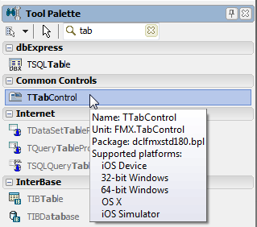{width="3.3229166666666665in"
height="2.9375in"}

3\. After you drop the **TTabControl**, an empty **TabControl** is shown
on the [[Form
Designer]{.underline}](http://docwiki.embarcadero.com/RADStudio/en/Form_Designer) (you
might need to manually adjust the position of the TabControl):

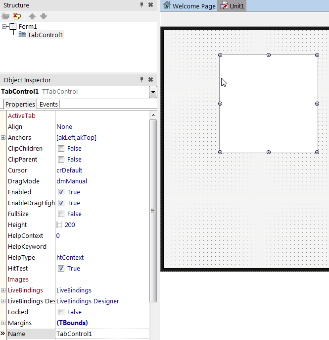{width="4.316485126859143in"
height="4.45279636920385in"}

4\. Typically, applications that use TabControl use the full screen to
show pages. \
To do this, you need to change the default alignment of TabControl. In
the [[Object
Inspector]{.underline}](http://docwiki.embarcadero.com/RADStudio/en/Object_Inspector),
change the **Align** property of TabControl to **Client**:

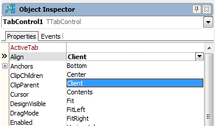{width="3.8333333333333335in"
height="2.2395833333333335in"}

5\. Right-click the TabControl, and select Items Editor\... from the
context menu:

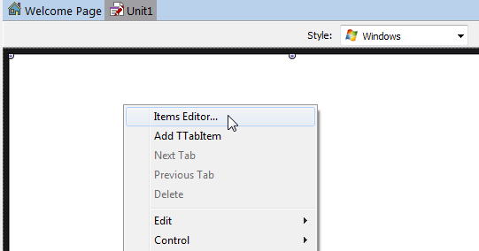{width="5.635416666666667in"
height="2.9583333333333335in"}

6\. Click **Add Item** three times, so that now you have three instances
of [[TabItem]{.underline}](http://docwiki.embarcadero.com/Libraries/en/FMX.TabControl.TTabItem) here.
Close the dialog box.

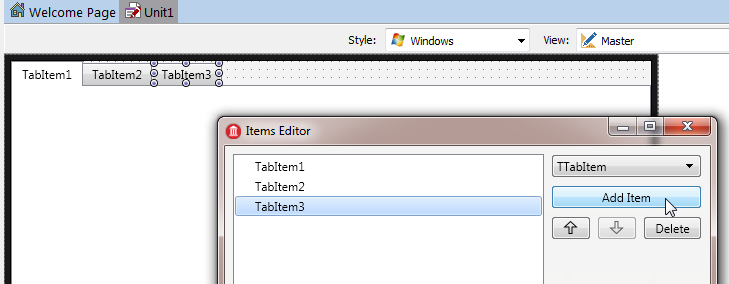{width="6.5in"
height="2.5322364391951004in"}

7\. On the [[Form
Designer]{.underline}](http://docwiki.embarcadero.com/RADStudio/en/Form_Designer),
select the first TabItem and change its **StyleLookup** property to
**tabitembookmarks** for **iOS Style**:

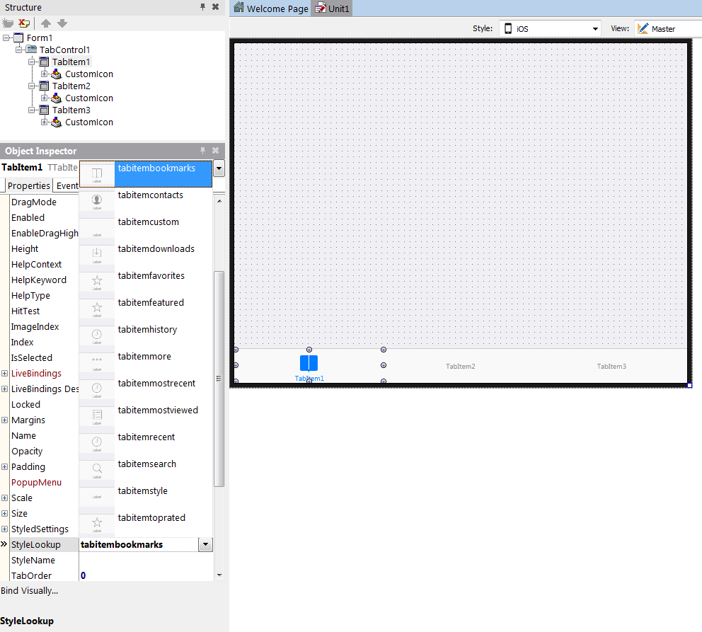{width="6.5in"
height="5.851310148731408in"}

8\. And for Android Style, on the [[Form
Designer]{.underline}](http://docwiki.embarcadero.com/RADStudio/en/Form_Designer),
select the first TabItem and change its **StyleLookup** property to
**tabitemstyle** :

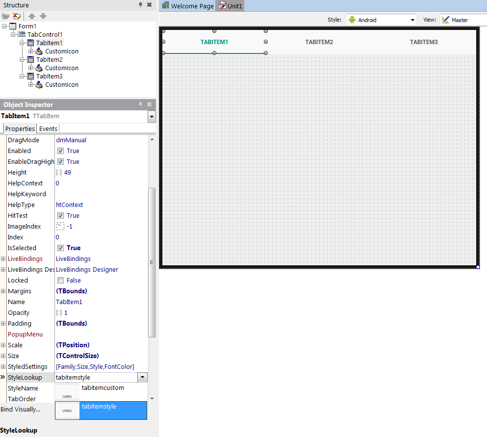{width="6.5in"
height="5.832326115485564in"}

9\. You can place any component on each page. \
To move to a different page, just click the tab you want on the Form
Designer, or change
the [**[ActiveTab]{.underline}**](http://docwiki.embarcadero.com/Libraries/en/FMX.TabControl.TTabControl.ActiveTab)
property in the [[Object
Inspector]{.underline}](http://docwiki.embarcadero.com/RADStudio/en/Object_Inspector): 

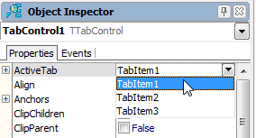{width="2.9583333333333335in"
height="1.59375in"}

10\. To change the location of tabs, select
the [**[TabPosition]{.underline}**](http://docwiki.embarcadero.com/Libraries/en/FMX.TabControl.TTabControl.TabPosition) property
for the TabControl component, and set it to one of the following values
in the [[Object
Inspector]{.underline}](http://docwiki.embarcadero.com/RADStudio/en/Object_Inspector):

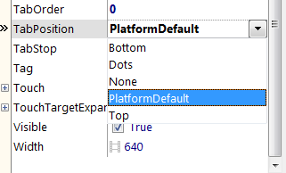{width="3.34375in"
height="2.0208333333333335in"}

## Comparing the Tab Settings on iOS and Android

The following figures show both apps with the
same [**[TabPosition]{.underline}**](http://docwiki.embarcadero.com/Libraries/en/FMX.TabControl.TTabControl.TabPosition) settings
(**Top**, **Bottom**, **Dots**, and **None**) on iOS and Android. \
However, you should set the appropriate different tab settings for each
mobile platform, as indicated in [[#Using the Native Style for Tabs on
iOS and
Android]{.underline}](http://docwiki.embarcadero.com/RADStudio/en/Mobile_Tutorial:_Using_Tab_Components_to_Display_Pages_(iOS_and_Android)#Using_the_Native_Style_for_Tabs_on_iOS_and_Android).

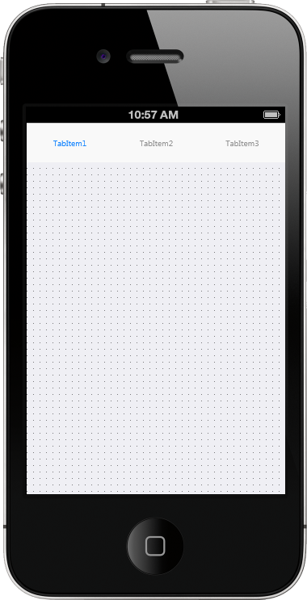{width="2.3518799212598425in"
height="4.598546587926509in"}
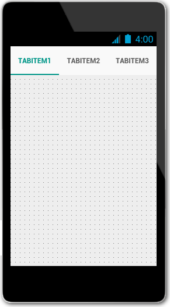{width="2.5663003062117236in"
height="4.621104549431321in"}

## 

## Using Custom Multi-Resolution Icons for Your Tabs

You can use custom multi-resolution icons as well as custom text on tabs
in your application. \
These steps shows you how to construct the following three tabs that
have custom icons and text:

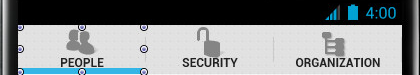{width="4.375in"
height="0.78125in"}

**Notes:**

- In **Android** apps, predefined icons are not supported, so you must
  use custom icons.

- In **iOS** apps, you can use either predefined icons or custom icons.

- To use custom icons on either iOS or Android, select the appropriate
  iOS or Android **Style** in the [[Form
  Designer]{.underline}](http://docwiki.embarcadero.com/RADStudio/en/Form_Designer),
  set the **StyleLookup** property
  of [[TTabItem]{.underline}](http://docwiki.embarcadero.com/Libraries/en/FMX.TabControl.TTabItem.Align) to **tabitemcustom**,
  specify your custom icon as described in this section, and then build
  your app.

- For iOS, you can use our predefined icons by setting
  the **StyleLookup** property
  of [[TTabItem]{.underline}](http://docwiki.embarcadero.com/Libraries/en/FMX.TabControl.TTabItem.Align) to
  the icon of your choice, such
  as {width="0.3333333333333333in"
  height="0.28125in"} (**tabitemsearch**).

- The custom glyphs used in this section are available in a zip file
  that is delivered in your C:\\Program Files
  (x86)\\Embarcadero\\Studio\\20.0\\Images\\GlyFX directory. \
  The three PNGs used here are located in
  the Icons\\Aero\\PNG\\32x32 directory:

  - **users_32** (People)

  - **unlock_32** (Security)

  - **tree_32** (Organization)

Unzip the **glyFX.zip** file before you use the MultiResBitmap Editor if
you want to use these images or any others available in the GlyFX
collection.

## Displaying Multi-Resolution Custom Icons on Tabs

1\. In the [[Object
Inspector]{.underline}](http://docwiki.embarcadero.com/RADStudio/en/Object_Inspector),
select **TabItem1**, and then change the tab caption, which is specified
in
the [[Text]{.underline}](http://docwiki.embarcadero.com/Libraries/en/FMX.TabControl.TTabItem.Text)
property to **People**; change the **Text** property
of **TabItem2** to **Security**, and **TabItem3** to **Organization**.

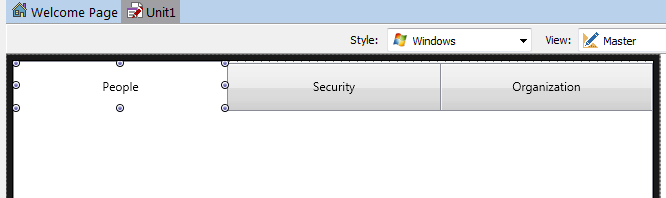{width="6.5in"
height="1.932432195975503in"}

2\. Select a tab, and click the ellipsis button \[\...\] on
the [**[CustomIcon]{.underline}**](http://docwiki.embarcadero.com/Libraries/en/FMX.TabControl.TTabItem.CustomIcon) property
of TTabItem in the [[Object
Inspector]{.underline}](http://docwiki.embarcadero.com/RADStudio/en/Object_Inspector):

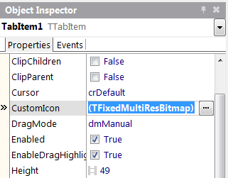{width="3.34375in"
height="2.6145833333333335in"}

3\. The [**[MultiResBitmap
Editor]{.underline}**](http://docwiki.embarcadero.com/RADStudio/en/MultiResBitmap_Editor) opens:

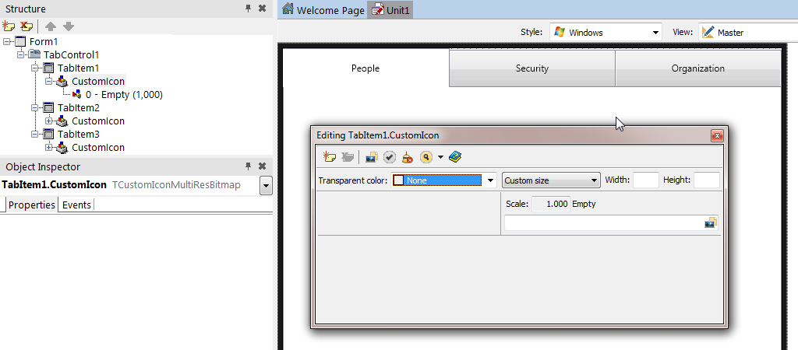{width="6.5in"
height="2.8564457567804022in"}

4\. Ensure that you are in the Master view, and in the MultiResBitmap
Editor, click the array next to **Custom size**, and then
choose **Default size**.

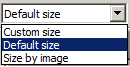{width="1.3541666666666667in"
height="0.6979166666666666in"}

5\. Repeat the following steps to add any additional scales that you
want to support:

1.  In the MultiResBitmap Editor,
    click {width="0.16666666666666666in"
    height="0.16666666666666666in"} (**Add new item**).

2.  Enter the additional Scale you want to support, such as 1.5, 2, or
    3.

    - When you have added all the scales you want, the editor looks like
      this:

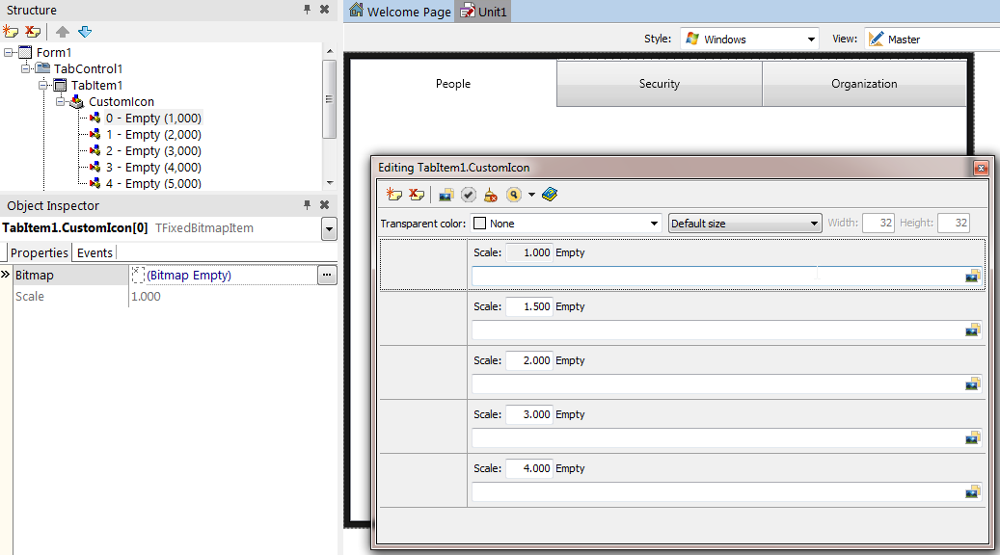{width="6.5in"
height="3.61041447944007in"}

6\. Click the **Fill All from
File** button 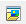{width="0.2708333333333333in"
height="0.25in"}, navigate to an image file you want to use, and then
click **Open**.

The selected image now appears appropriately scaled in each of the Scale
entries on the MultiResBitmap Editor:

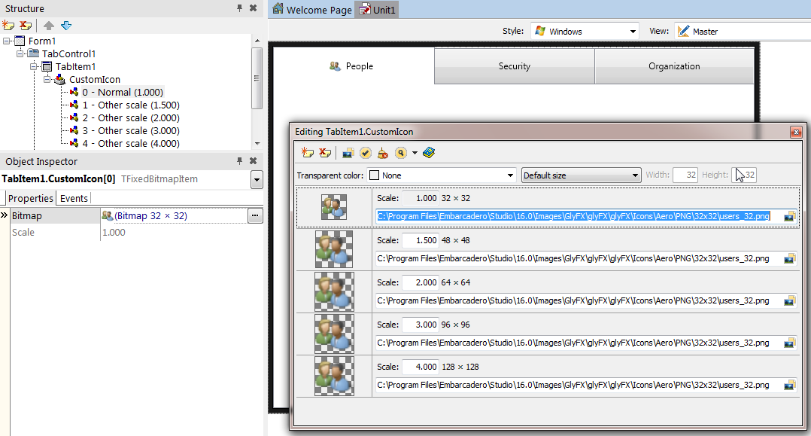{width="6.5in"
height="3.4911876640419948in"}

7\. Close the MultiResBitmap Editor.

8\. Repeat Steps 2 to 7 for each of the remaining tabitems, and assign
each tabitem a custom icon image.

After you define a custom icon, the FireMonkey framework generates
a **Selected Image** and **Non-Selected (dimmed) Image** based on the
given .png file. This transformation is done using the Alpha-Channel of
the bitmap data. For example:

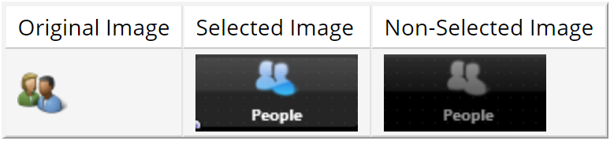{width="6.5in"
height="1.49375in"}

## 

## Using a Single-Resolution Bitmap for a Custom Icon

You can also use only a single-resolution bitmap by using the [**[Bitmap
Editor]{.underline}**](http://docwiki.embarcadero.com/RADStudio/en/Bitmap_Editor).
A single-resolution bitmap displays only one scale in the Structure
View:

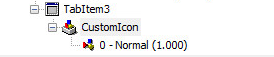{width="2.8541666666666665in"
height="0.59375in"}

To specify a single-resolution bitmap for a custom icon, perform
the [[first step of the procedure
above]{.underline}](http://docwiki.embarcadero.com/RADStudio/en/Mobile_Tutorial:_Using_Tab_Components_to_Display_Pages_(iOS_and_Android)#Using_Custom_Multi-Resolution_Icons_for_Your_Tabs) and
then proceed as follows:

1.  In the [[Structure
    View]{.underline}](http://docwiki.embarcadero.com/RADStudio/en/Structure_View),
    select **Empty** under CustomIcon:

{width="3.78125in"
height="1.4375in"}

2.  Now, in the [[Object
    Inspector]{.underline}](http://docwiki.embarcadero.com/RADStudio/en/Object_Inspector),
    click the ellipsis button \[\...\] in the **Bitmap** field (of
    the [[TabItem1.CustomIcon\[0\]]{.underline}](http://docwiki.embarcadero.com/Libraries/en/FMX.MultiResBitmap.TFixedBitmapItem)).
    This opens the [**[Bitmap
    Editor]{.underline}**](http://docwiki.embarcadero.com/RADStudio/en/Bitmap_Editor):

{width="3.8333333333333335in"
height="1.25in"}

3.  In the [**[Bitmap
    Editor]{.underline}**](http://docwiki.embarcadero.com/RADStudio/en/Bitmap_Editor),
    click the **Load\...** button, and select a PNG file. \
    The recommended size is 30x30 pixels for normal resolution, and
    60x60 pixels for high resolution:

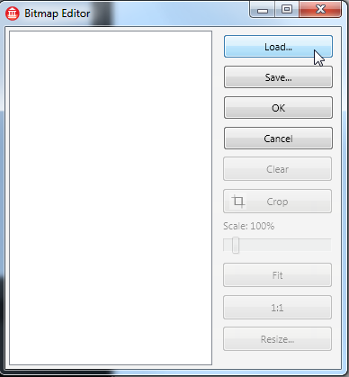{width="2.283833114610674in"
height="2.466304680664917in"}

4.  Click **OK** to close the **Bitmap Editor**.

5.  In the [[Object
    Inspector]{.underline}](http://docwiki.embarcadero.com/RADStudio/en/Object_Inspector),
    set the **StyleLookup** property to be **tabitemcustom**:

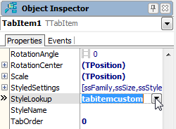{width="2.6041666666666665in"
height="1.9166666666666667in"}

Defining Controls within a TabControl

As discussed, each Tab Page can contain any number of controls including
another TabControl. In such a case, you can easily browse and manage
different tab pages in the [[Structure
View]{.underline}](http://docwiki.embarcadero.com/RADStudio/en/Structure_View):

  ---------------------------------------------------------------------------------------------------------------------------------------------------------
  **iOS**
  ---------------------------------------------------------------------------------------------------------------------------------------------------------
  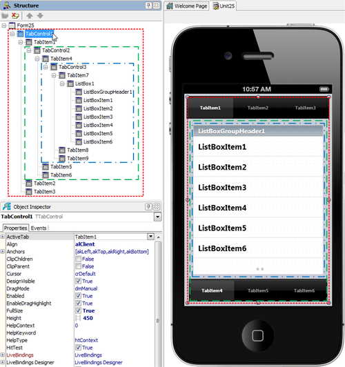{width="3.683299431321085in"
  height="3.9190299650043743in"}

  ---------------------------------------------------------------------------------------------------------------------------------------------------------

  ----------------------------------------------------------------------------------------------------------------------------------------------------------------
  **Android**
  ----------------------------------------------------------------------------------------------------------------------------------------------------------------
  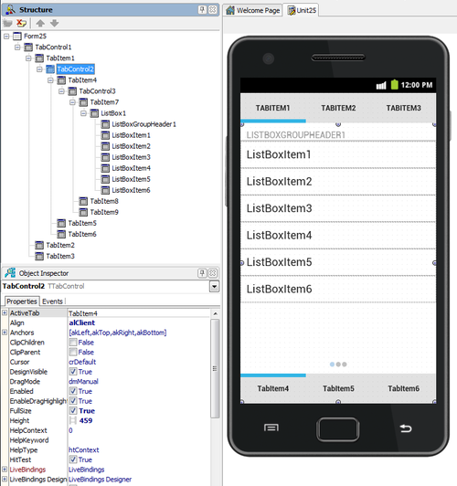{width="3.97159886264217in"
  height="4.225781933508311in"}

  ----------------------------------------------------------------------------------------------------------------------------------------------------------------

## Changing the Page at RunTime

### By the User Tapping the Tab

If Tabs are visible (when
the [[TabPosition]{.underline}](http://docwiki.embarcadero.com/Libraries/en/FMX.TabControl.TTabControl.TabPosition) property
is set to other than None), an end user can simply tap a Tab to open the
associated page.

### By Actions and an ActionList

An [[action]{.underline}](http://docwiki.embarcadero.com/RADStudio/en/FireMonkey_Actions) corresponds
to one or more elements of the user interface, such as menu commands,
toolbar buttons, and controls. Actions serve two functions:

- Actions represent properties common to the user interface elements,
  such as whether a control is enabled or whether a checkbox is
  selected.

- Actions respond when a control fires, for example, when the
  application user clicks a button or chooses a menu item.

Here are the steps to enable a user to move to different tab pages by
clicking a button:

1.  On the [[Form
    Designer]{.underline}](http://docwiki.embarcadero.com/RADStudio/en/Form_Designer),
    click **TabItem1** to select it.

2.  From the [**[Tool
    Palette]{.underline}**](http://docwiki.embarcadero.com/RADStudio/en/Tool_Palette),
    add
    a [**[TActionList]{.underline}**](http://docwiki.embarcadero.com/Libraries/en/FMX.ActnList.TActionList) component
    to the form, and then add
    a [[TButton]{.underline}](http://docwiki.embarcadero.com/Libraries/en/FMX.StdCtrls.TButton) to **TabItem1**:

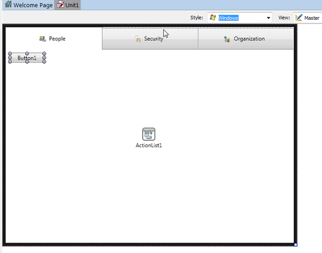{width="3.61040791776028in"
height="2.8423753280839894in"}

3.  With the button selected, in the [[Object
    Inspector]{.underline}](http://docwiki.embarcadero.com/RADStudio/en/Object_Inspector),
    select **Action \| New Standard Action \| Tab
    \> [[TChangeTabAction]{.underline}](http://docwiki.embarcadero.com/Libraries/en/FMX.TabControl.TChangeTabAction)** from
    the drop-down menu. After the user clicks this button, the action
    you just defined is performed (the tab page changes):

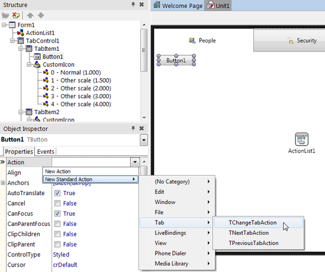{width="4.896198600174978in"
height="4.095002187226597in"}

4.  Select **ChangeTabAction1** in the [[Structure
    View]{.underline}](http://docwiki.embarcadero.com/RADStudio/en/Structure_View),
    and then select **TabItem2** for the **Tab** property in the Object
    Inspector. By linking to **TabItem2**, this action can change the
    page to **TabItem2**:

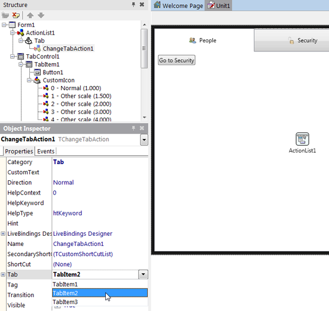{width="5.729166666666667in"
height="5.427083333333333in"}

5.  With the previous step, the caption (the Text property) of the
    button is automatically changed to \"Go To Security\" because the
    caption of **TabItem2** is \"Security\" in our example. Set
    the [**[CustomText]{.underline}**](http://docwiki.embarcadero.com/Libraries/en/FMX.TabControl.TChangeTabAction.CustomText) property
    of the **ChangeTabAction1** component to **Security** as shown below
    and change the size of the button to fit the new caption text, if
    required.

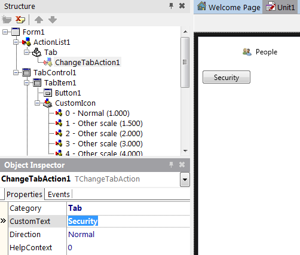{width="5.229166666666667in"
height="4.447916666666667in"}

6.  ChangeTabAction also supports the **Slide** animation to indicate a
    transition between pages. To use it, set
    the [**[Transition]{.underline}**](http://docwiki.embarcadero.com/Libraries/en/FMX.TabControl.TChangeTabAction.Transition) property
    to **Slide**:

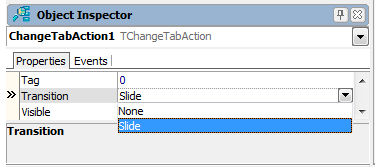{width="3.9270833333333335in"
height="1.7395833333333333in"}

7.  On the Form Designer, select **TabItem2** and drop two TButtons from
    the Tool Palette to **TabItem2**.

8.  On the Form Designer, select **Button2** and in the Object
    Inspector, select **Action \| New Standard Action \| Tab
    \> [[TPreviousTabAction]{.underline}](http://docwiki.embarcadero.com/Libraries/en/FMX.TabControl.TPreviousTabAction)** from
    the drop-down menu.

9.  On the Form Designer, select **Button3** and in the Object
    Inspector, select **Action \| New Standard Action \| Tab
    \> [[TNextTabAction]{.underline}](http://docwiki.embarcadero.com/Libraries/en/FMX.TabControl.TNextTabAction)** from
    the drop-down menu.

10. Select **PreviousTabAction1** in the Structure View and in the
    Object Inspector, set
    its [[TabControl]{.underline}](http://docwiki.embarcadero.com/Libraries/en/FMX.TabControl.TPreviousTabAction.TabControl) property
    to **TabControl1**.

11. Select **NextTabAction1** in the Structure View and in the Object
    Inspector, set
    its [[TabControl]{.underline}](http://docwiki.embarcadero.com/Libraries/en/FMX.TabControl.TPreviousTabAction.TabControl) property
    to **TabControl1**.

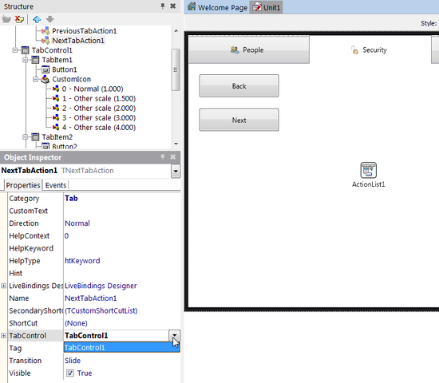{width="5.729166666666667in"
height="5.0in"}

12. On the Form Designer, select **TabItem3** and drop a TButton from
    the Tool Palette to **TabItem3**.

13. In the Object Inspector, set
    the [[Action]{.underline}](http://docwiki.embarcadero.com/Libraries/en/FMX.StdCtrls.TButton.Action) property
    of the button to **PreviousTabAction1**.

## 

## By Source Code

You can use any of the following three ways to change the active tab
page from your source code, by clicking the button.

Assign an Instance
of [[TTabItem]{.underline}](http://docwiki.embarcadero.com/Libraries/en/FMX.TabControl.TTabItem) to
the [[ActiveTab]{.underline}](http://docwiki.embarcadero.com/Libraries/en/FMX.TabControl.TTabControl.ActiveTab) Property

1.  From the Tool Palette, add
    a [[TButton]{.underline}](http://docwiki.embarcadero.com/Libraries/en/FMX.StdCtrls.TButton) to **TabItem3**.

2.  In the Object Inspector, set its **Text** property to **Go To
    People**.

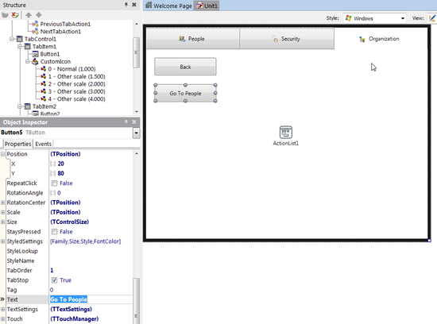{width="5.729166666666667in"
height="4.25in"}

3.  On the Form Designer, double-click the button to create
    the [[OnClick]{.underline}](http://docwiki.embarcadero.com/Libraries/en/FMX.StdCtrls.TButton.OnClick) event
    handler and add the following code:

**Delphi:**

TabControl1.ActiveTab := TabItem1;

**C++: **

TabControl1-\>ActiveTab = TabItem1;

## Change the [[TabIndex]{.underline}](http://docwiki.embarcadero.com/Libraries/en/FMX.TabControl.TTabControl.TabIndex) Property to a Different Value

The TabIndex property is a zero-based Integer value. You can specify any
number between 0 and TabControl1.TabCount - 1.

1.  From the Tool Palette, add
    a [[TButton]{.underline}](http://docwiki.embarcadero.com/Libraries/en/FMX.StdCtrls.TButton) to TabItem1.

2.  In the Object Inspector, set its Text property to Go To
    Organization.

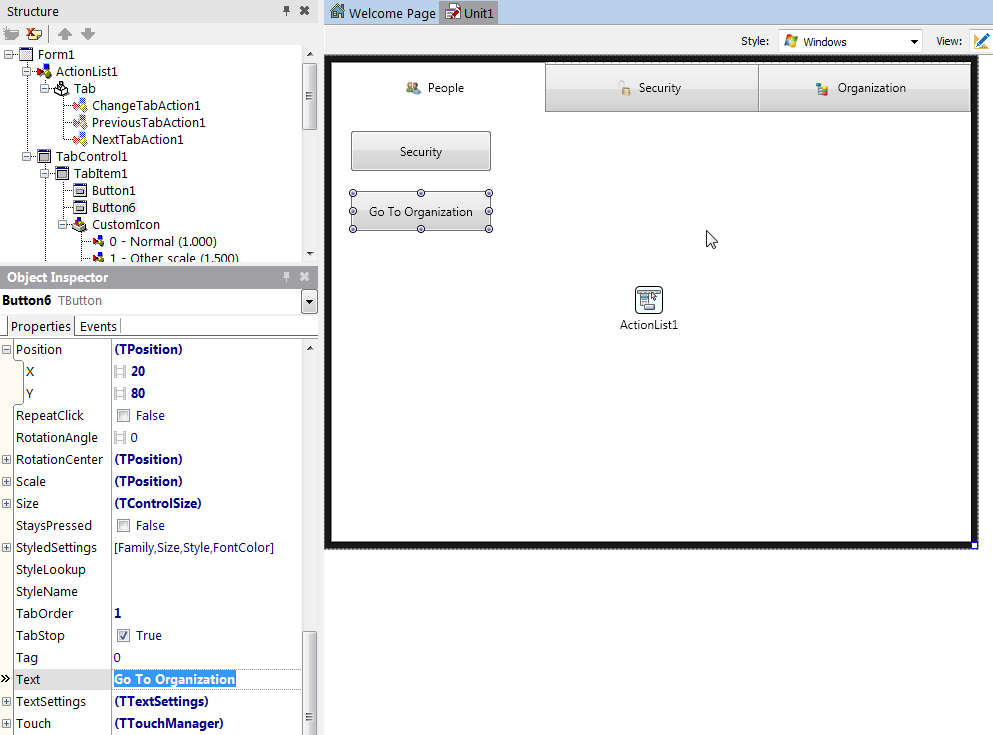{width="6.5in"
height="4.8111778215223096in"}

3\. On the Form Designer, double-click the button to create
the [[OnClick]{.underline}](http://docwiki.embarcadero.com/Libraries/en/FMX.StdCtrls.TButton.OnClick) event
handler and add the following code:

**Delphi:**

TabControl1.TabIndex := 2;

**C++:** 

TabControl1-\>TabIndex = 2;

Call
the [[ExecuteTarget]{.underline}](http://docwiki.embarcadero.com/Libraries/en/FMX.TabControl.TChangeTabAction.ExecuteTarget) Method
of a Tab Action

You can call
the [[ExecuteTarget]{.underline}](http://docwiki.embarcadero.com/Libraries/en/FMX.TabControl.TChangeTabAction.ExecuteTarget) method
for any of the tab control actions
([[TChangeTabAction]{.underline}](http://docwiki.embarcadero.com/Libraries/en/FMX.TabControl.TChangeTabAction), [[TNextTabAction]{.underline}](http://docwiki.embarcadero.com/Libraries/en/FMX.TabControl.TNextTabAction),
and [[TPreviousTabAction]{.underline}](http://docwiki.embarcadero.com/Libraries/en/FMX.TabControl.TPreviousTabAction)).
You must ensure to define
the [[TChangeTabAction.Tab]{.underline}](http://docwiki.embarcadero.com/Libraries/en/FMX.TabControl.TChangeTabAction.Tab), [[TPreviousTabAction.TabControl]{.underline}](http://docwiki.embarcadero.com/Libraries/en/FMX.TabControl.TPreviousTabAction.TabControl) or
the [[TNextTabAction.TabControl]{.underline}](http://docwiki.embarcadero.com/Libraries/en/FMX.TabControl.TNextTabAction.TabControl) properties.

**Delphi:**

*// You can set the target at run time if it is not defined yet.*

ChangeTabAction1.Tab := TabItem2;

*// Call the action*

ChangeTabAction1.ExecuteTarget(**nil**);

**C++:** 

*// You can set the target at run time if it is not defined yet.*

ChangeTabAction1-\>Tab = TabItem2;

*// Call the action*

ChangeTabAction1-\>ExecuteTarget(NULL);

This Lab Exercise gave you a detailed understanding on how to use the
Tab Components to Display Pages on both iOS and Android.
