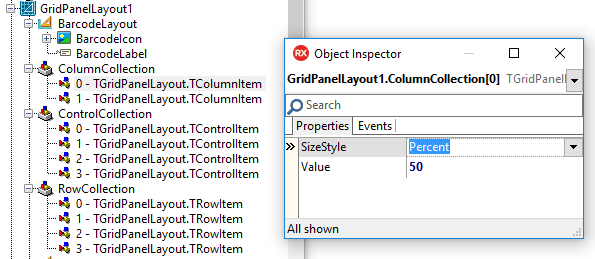
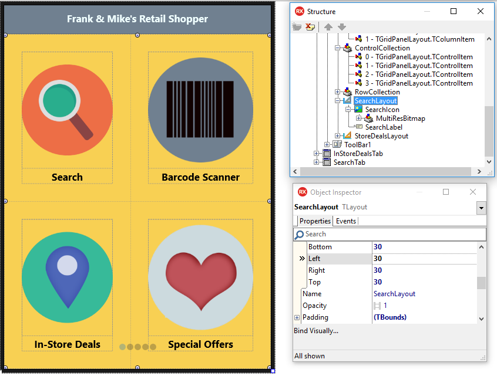

# FMX Mobile Application Development

## **LAB Exercise 03.08:** Home Screen Navigation with glyph buttons{width="1.9886876640419948in" height="4.045613517060367in"}

Home screens are a popular design paradigm as they display the key app
functionality on the first screen, making it easily accessible to the
application user. Home Screen navigation usually consists of glyph
buttons arranged in a grid-like layout and may span over multiple
screens.

This Lab Exercise shows the steps for creating a Home Screen design like
this that you can use as the first tab of your application.

**Step 1:  Set up the UI**

**File \| New \| Multi-Device Application (Blank).**

This application consists of 6 tabs, with
[[TTabControl]{.underline}](http://docwiki.embarcadero.com/Libraries/en/FMX.TabControl.TTabControl)\'s
TabPosition property set to None.

To set up the Home Screen design, add a toolbar and a label to Tab 1
(HomeScreenTab).

Set
[[TToolbar]{.underline}](http://docwiki.embarcadero.com/Libraries/en/FMX.StdCtrls.TToolBar)\'s
Align property to Top, and
[[TLabel]{.underline}](http://docwiki.embarcadero.com/Libraries/en/FMX.StdCtrls.TLabel)\'s
Align property to Contents, and the Text Settings HorzAlign property to
Center. 

Next, add a TGridPanelLayout control to Tab1 and align it to the Client.

**Step 2: Adjust the
[[TGridPanelLayout]{.underline}](http://docwiki.embarcadero.com/Libraries/en/FMX.Layouts.TGridPanelLayout)
settings**

With GridPanelLayout1 selected in the Object Inspector, drag and drop a
[[TLayout]{.underline}](http://docwiki.embarcadero.com/Libraries/en/FMX.Layouts.TLayout)
control onto your form.

Repeat these steps 3 times. 

Align each TLayout control to the client. This ensures even spacing and
alignment for each of the 4 icons. Select the ColumnCollection property
for GridPanelLayout1 in the Object Inspector.

Set the % for each column to 50% to ensure the columns are evenly
spaced. Repeat this step for the RowCollection property.
{width="5.276042213473316in"
height="2.3179265091863517in"}

**Step 3: Add images and text**

- Select each Layout control in the Object Inspector, and parent a
  [[TImage]{.underline}](http://docwiki.embarcadero.com/Libraries/en/FMX.Objects.TImage)
  control and
  [[TLabel]{.underline}](http://docwiki.embarcadero.com/Libraries/en/FMX.StdCtrls.TLabel)
  to it.

- Align each TImage to the client.

- Align each TLabel to the bottom. 

**Step 4: Set margins, adjust font settings and more  **\
Select each layout control in the Object Inspector and set your margins.

In this example, I set bottom, top, left and right to 30.

I then created views for each of my target devices (iPhone 4.7 inch,
Android 5 inch etc.) and adjusted the margins and font size to ensure
the text and images were displayed properly on each of my target
devices.

By selecting the ControlCollection property in the Object Inspector, you
can also adjust the placement and order of each of your layouts.

{width="6.5in"
height="5.017139107611548in"}
